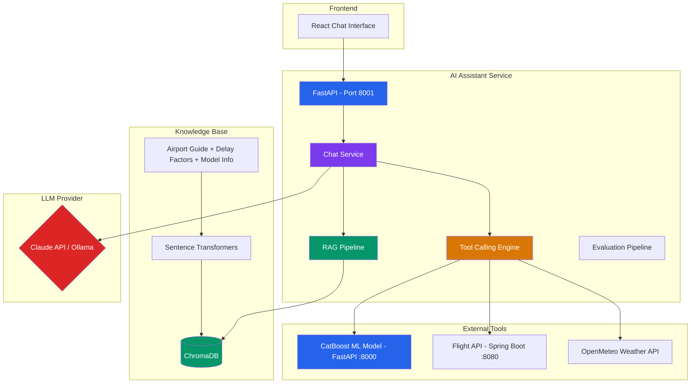

# FlightOnTime AI Assistant

> Intelligent flight delay prediction assistant powered by RAG + Tool-Calling + CatBoost ML

An AI-powered conversational assistant that predicts Brazilian domestic flight delays by combining a trained CatBoost machine learning model with Retrieval-Augmented Generation (RAG) and LLM tool-calling capabilities.

## Architecture



## How It Works

```
User: "Will my GOL flight from São Paulo to Rio tomorrow at 2pm be delayed?"

1. RAG Retrieval    → Fetches relevant context about CGH/SDU airports and delay patterns
2. Tool Calling     → Calls predict_flight_delay with airline=GOL, origin=Congonhas, dest=Santos Dumont
3. ML Prediction    → CatBoost model returns 23% delay probability (🟢 Low Risk)
4. Weather Check    → OpenMeteo confirms 0mm rain, 8km/h wind
5. LLM Generation   → Combines all context into a natural language response with actionable advice
```

## Features

| Feature | Description |
|---------|-------------|
| **RAG Pipeline** | Knowledge base about Brazilian airports, delay factors, and model details indexed in ChromaDB |
| **Tool Calling** | LLM autonomously calls flight prediction model, airport lookup, and weather APIs |
| **Dual LLM Support** | Works with Claude API (Anthropic) or Ollama (local, free) |
| **Session Memory** | Conversation history maintained per session |
| **Evaluation Pipeline** | Automated evaluation with tool accuracy, context retrieval, and latency metrics |
| **Source Citations** | Every response includes the knowledge sources used |
| **Multilingual** | Responds in Portuguese, English, or Spanish based on user input |

## Tech Stack

| Component | Technology |
|-----------|-----------|
| API Framework | FastAPI |
| LLM (Cloud) | Claude API (Anthropic SDK) |
| LLM (Local) | Ollama (llama3.1:8b) |
| Embeddings | sentence-transformers (all-MiniLM-L6-v2) |
| Vector Store | ChromaDB |
| ML Model | CatBoost (via FlightOnTime data-science service) |
| Weather Data | OpenMeteo API |
| HTTP Client | httpx (async) |

## Quick Start

### Prerequisites

- Python 3.11+
- [Ollama](https://ollama.ai) installed with `llama3.1:8b` model
- FlightOnTime data-science service running on port 8000 (optional for tool-calling)

### Setup

```bash
cd ai-assistant

python -m venv .venv
source .venv/bin/activate

pip install -r requirements.txt

cp .env.example .env
# Edit .env with your configuration

uvicorn app.main:app --reload --port 8001
```

### Usage

**Chat endpoint:**
```bash
curl -X POST http://localhost:8001/chat \
  -H "Content-Type: application/json" \
  -d '{
    "message": "Will my GOL flight from Congonhas to Santos Dumont tomorrow at 14:00 be delayed?",
    "session_id": "user1"
  }'
```

**Response:**
```json
{
  "message": "Based on the prediction model, your GOL flight from Congonhas to Santos Dumont has a 23% delay probability (🟢 Low Risk)...",
  "session_id": "user1",
  "sources": [
    {
      "document": "airport_guide.md",
      "chunk": "São Paulo - Congonhas (CGH) - One of Brazil's busiest airports...",
      "relevance_score": 0.8234
    }
  ],
  "tools_used": [
    {
      "tool_name": "predict_flight_delay",
      "tool_input": {"airline": "GOL", "origin": "Congonhas", "destination": "Santos Dumont", "departure_datetime": "2025-12-24T14:00:00"},
      "tool_result": {"prediction": "ON_TIME", "probability": 0.23, "risk_color": "green"}
    }
  ],
  "model_used": "llama3.1:8b",
  "latency_ms": 3421.5
}
```

### API Endpoints

| Method | Endpoint | Description |
|--------|----------|-------------|
| POST | `/chat` | Send a message and get AI response |
| GET | `/chat/history/{session_id}` | Get conversation history |
| DELETE | `/chat/history/{session_id}` | Clear session history |
| GET | `/health` | Health check |
| GET | `/docs` | Swagger UI (auto-generated) |

### Run Evaluation

```bash
python -m app.evaluation.run_eval
```

Outputs tool accuracy, context retrieval accuracy, pass rate, and average latency across 10 test cases.

## Project Structure

```
ai-assistant/
├── app/
│   ├── main.py              # FastAPI application with lifespan
│   ├── config.py             # Pydantic settings (env-based)
│   ├── chat/
│   │   ├── router.py         # API endpoints
│   │   ├── service.py        # Chat orchestration (RAG + Tools + LLM)
│   │   ├── llm_client.py     # Abstract LLM client (Anthropic / Ollama)
│   │   └── schemas.py        # Pydantic request/response models
│   ├── rag/
│   │   ├── ingestion.py      # Document chunking + ChromaDB indexing
│   │   ├── retrieval.py      # Semantic search over knowledge base
│   │   └── knowledge/        # Domain knowledge documents
│   ├── tools/
│   │   ├── flight_predictor.py   # Calls CatBoost ML model
│   │   ├── airport_lookup.py     # Queries airport database
│   │   └── weather_checker.py    # Fetches OpenMeteo weather
│   └── evaluation/
│       ├── eval_dataset.json     # Test cases
│       └── run_eval.py           # Evaluation pipeline
├── requirements.txt
├── Dockerfile
├── .env.example
└── README.md
```

## Integration with FlightOnTime

This service extends the existing FlightOnTime ecosystem:

```
FlightOnTime Ecosystem
├── front-end/          → React UI (flight search form)
├── back-end/           → Spring Boot API (auth, airports, airlines)
├── data-science/       → CatBoost ML model + FastAPI (v5.0)
├── data-science-prod/  → Production ML pipeline (v6.0)
├── ai-assistant/       → THIS SERVICE (RAG + LLM + Tool Calling)
└── infrastructure/     → Docker + OCI deployment
```

The AI Assistant communicates with the existing data-science service for predictions and the backend for airport/airline data, adding a conversational AI layer on top of the existing ML infrastructure.
